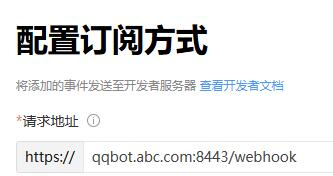

# Gensokyo_docker_tutorial

本教程适用于 [beta509](https://github.com/Hoshinonyaruko/Gensokyo/commit/1c6e0723c92c7f6485d0df97c0da18d6cf53578e) 或更高版本的 [Gensokyo](https://github.com/Hoshinonyaruko/Gensokyo)，采用 Docker 部署，Nginx 反向代理，SSL 8443 端口复用，以及 Webhook 配置。请根据你的实际情况修改配置。

## 准备工作
- 已经申请好的QQ机器人， 本次案例使用 123456 这个QQ号
- 一个已经国内备案，属于你的域名，本次案例使用 qqbot.abc.com 这个二级域名
- 一个对应域名的SSL证书
- 服务器推荐使用ubuntu 24.04, debian 12，需要IPv4公网地址，不支持IPv6（家庭宽带也可以，配合DDNS使用）
- 安装docker和docker-compose，国内服务器还需要配置好docker镜像加速
- 服务器推荐使用 [1Panel](https://1panel.cn) 面板，方便管理网站，SSL证书，Docker容器等

## Docker 部署

- 前往 [Releases](https://github.com/Hoshinonyaruko/Gensokyo/releases) 下载最新版的 Gensokyo，例如 [gensokyo-linux-amd64](https://github.com/Hoshinonyaruko/Gensokyo/releases/download/512%2Fmerge/gensokyo-linux-amd64)。
- 假设你的 QQ Bot 号码是 123456。

  ```bash
  mkdir -p /opt/qqbot/123456
  cd /opt/qqbot/123456
  wget https://github.com/Hoshinonyaruko/Gensokyo/releases/download/512%2Fmerge/gensokyo-linux-amd64
  mv gensokyo-linux-amd64 gensokyo
  chmod +x gensokyo
  ./gensokyo # 首次执行，会生成 config.yml 并要求配置
  ```

- 准备好你域名的 SSL 证书，假设你的域名是 qqbot.abc.com，并已经申请好了 SSL。

  ```bash
  mkdir -p /opt/qqbot/123456/cert
  ```

  将证书的 fullchain.pem 和 privkey.pem 放入此目录。每家的 SSL 证书名称可能有所不同，具体请参考 Gensokyo 的教程。

- 初步编辑 config.yml，以下是群机器人的部分配置参考：

  ```yaml
  # 反向 WebSocket 设置
  ws_address: ["ws://192.168.1.10:8080/ws"] # 如果是 Docker 容器内运行 Gensokyo，需要将 WebSocket 地址设置为宿主机或容器映射的地址，不能使用 127.0.0.1 或 localhost
  ws_token: ["","",""] # 连接 WebSocket 地址时服务器所需的 token，按顺序一一对应，如果是 ws 地址，没有密钥，请留空
  # 基础设置（以下均为 QQ Bot 必填项）
  app_id: 12345 # 你的应用 ID
  uin: 0 # 你的机器人 QQ 号，点击机器人资料卡查看
  use_uin: false # false=使用 appid 作为机器人 ID，true=使用机器人 QQ 号，需设置正确的 uin
  token: "<YOUR_APP_TOKEN>" # 你的应用令牌
  client_secret: "<YOUR_CLIENT_SECRET>" # 你的客户端密钥
  # Gensokyo 互联类
  server_dir: "qqbot.abc.com" # 这里必须填你的域名, IP没试过
  port: "8443" # 官方 Webhook 只支持 80、443、8080、8443 端口，且启用 SSL
  # SSL 配置类 和 白名单域名自动验证
  crt: "./cert/fullchain.pem" # 就是前面设置的
  key: "./cert/privkey.pem" # 就是前面设置的
  webhook_path: "webhook" # 默认不用改
  force_ssl: true # 必须打开
  http_port_after_ssl: "8888" # 这是后备 HTTP 端口，必须设置，不能与前面的 port 重复
  ```

- 保存 config.yml，前往 /opt/qqbot，新建一个 docker-compose.yml：

  ```yaml
  # docker-compose.yml
  services:
    qqbot-123456:
      image: alpine:latest
      container_name: qqbot-123456
      restart: always
      ports:
        - 8888:8888 # 只映射后备 HTTP 端口，并且前后必须一致
      volumes:
        - /usr/share/zoneinfo/Asia/Shanghai:/etc/localtime:ro # 映射时区
        - ${PWD}/123456:/app
      working_dir: /app
      command: sh -c "/app/gensokyo"
  ```

  如果你有多个 QQ Bot 需要多开，可以参考上面的 YAML 文件复制多个服务。

- 在 /opt/qqbot 目录，启动 Bot：

  ```bash
  cd /opt/qqbot
  docker-compose up -d
  ```

## Nginx 反向代理

- 首先，确保你已经在 Nginx 或 Web 面板中配置好 qqbot.abc.com（例如 1Panel、宝塔），纯静态网站即可。
- 配置好 qqbot.abc.com 的 SSL 证书。
- 由于本教程以 8443 端口为准，需要编辑网站的配置文件，找到：

  ```bash
  server {
      listen 80;
      listen 443 ssl http2;
      listen 8443 ssl http2; # 新增一行，监听 8443 端口
  ```

  后续其他网站需要使用 8443 端口也这么配置，实现了端口复用不浪费，443 同理。

- 配置反向代理，这里我只将两个个必要的目录反代出来，其他目录按需映射：

  channel_temp 目录，用于发送图片和音频：

  ```bash
  location ^~ /channel_temp {
      proxy_pass http://127.0.0.1:8888/channel_temp; # 8888 端口就是前面说的后备 HTTP 端口
      proxy_set_header Host $host;
      proxy_set_header X-Real-IP $remote_addr;
      proxy_set_header X-Forwarded-For $proxy_add_x_forwarded_for;
      proxy_set_header REMOTE-HOST $remote_addr;
      proxy_set_header Upgrade $http_upgrade;
      proxy_set_header Connection $http_connection;
      proxy_set_header X-Forwarded-Proto $scheme;
      proxy_http_version 1.1;
      add_header X-Cache $upstream_cache_status;
      add_header Cache-Control no-cache;
      proxy_ssl_server_name off;
      proxy_ssl_name $proxy_host;
  }
  ```

  webhook 目录，用于与 QQ Bot 服务器对接：

  ```bash
  location /webhook {
      proxy_pass http://127.0.0.1:8888/webhook; # 8888 端口就是前面说的后备 HTTP 端口
      proxy_set_header Host $host;
      proxy_set_header X-Real-IP $remote_addr;
      proxy_set_header X-Forwarded-For $proxy_add_x_forwarded_for;
      proxy_set_header REMOTE-HOST $remote_addr;
      proxy_set_header Upgrade $http_upgrade;
      proxy_set_header Connection $http_connection;
      proxy_set_header X-Forwarded-Proto $scheme;
      proxy_http_version 1.1;
      add_header X-Cache $upstream_cache_status;
      add_header Cache-Control no-cache;
      proxy_ssl_server_name off;
      proxy_ssl_name $proxy_host;
  }
  ```

## Webhook 配置

上述服务都配置完成后，测试公网访问 Webhook 接口是否正常：

```bash
curl -X POST https://qqbot.abc.com:8443/webhook
```

如果返回：

```json
{"error":"Invalid signature"}
```

那么恭喜你，Webhook 端口已经配置正确。

最后，在 q.qq.com 登录你的 Bot 管理后台，前往“开发 - 回调配置”，测试通过后，扫码确认配置。



别忘了下面的“添加事件”也要选上，扫码确认配置。